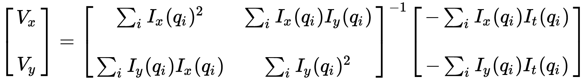

# CSE 455 Homework 3 #

Welcome friends,

It's time for optical flow!

To start out this homework, copy over your `process_image.cpp`, `filter_image.cpp`, `resize_image.cpp`, `harris_image.cpp`, and`panorama_image.cpp` files from hw2 to the `src` directory in this homework. We will be continuing to build out your image library.

## 1. Lucas-Kanade optical flow ##

We'll be implementing [Lucas-Kanade](https://en.wikipedia.org/wiki/Lucas%E2%80%93Kanade_method) optical flow. We'll use a structure matrix but this time with temporal information as well. The equation we'll use is:

Note the first matrix consists of 3 different elements and corresponds to `S'S` from the lecture slides and the second term is a 2-vector corresponding to `S'T`. We put the resulting 5 numbers in the so called Time-structure-matrix.

## 1.1 Time-structure matrix ##

We'll need spatial and temporal gradient information for the flow equations. Calculate a time-structure matrix. Spatial gradients can be calculated as normal. The time gradient can be calculated as the difference between the previous image and the next image in a sequence. Fill in `time_structure_matrix`. At the end filter the resulting matrix with a `sigma=s`. Use the provided function `fast_smooth_image` for fast gaussian smoothing.

## 1.2 Calculate the eigenvalues of `S'S` ##

To know whether we have enough information to compute the optical flow we need to know whether the matrix `S'S` is invertible.
Compute the two eigenvalues per pixel and return an image with two channels

## 1.3 Calculating velocity from the structure matrix ##

Fill in `velocity_image` to use the equation to calculate the velocity of each pixel in the x and y direction. For each pixel, produce a matrix `S'S` and a vector `S'T` using the classes `class Matrix2x2` and `class Vector2`. Invert the matrix, and use it to calculate the velocity.

Try calculating the optical flow between two images

    Image a = load_image("data/a.jpg");
    Image b = load_image("data/b.jpg");
    Image flow = optical_flow_images(b, a)
    draw_flow(a, flow, 8)
    save_image(a, "lines")

It may look something like:

## 2. Optical flow demo using OpenCV or Pangolin ##

Using OpenCV and Pangolin we can get images from the webcam and display the results in real-time. 

## 3. Turn it in ##

Turn in your `flow_image.cpp` on canvas under Assignment 3.
